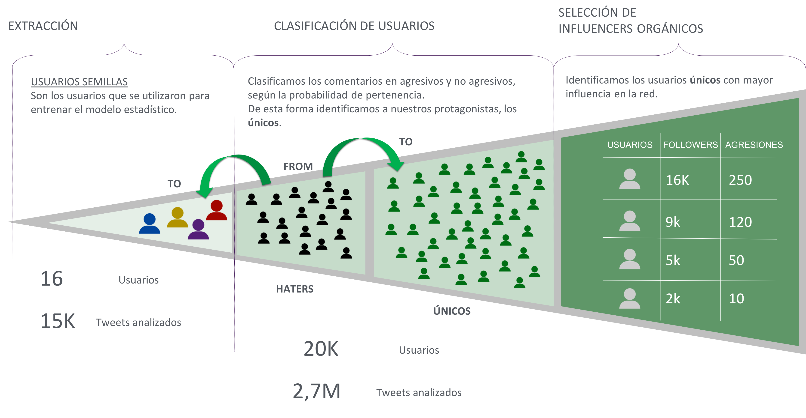

# Haters Detector

In this project I had to detect if a tweet has a hater connotation to other user. I think creative area has a lot of crazy ideas but when you try to put them into operation you can crash with a big wall of reality. When you start looking at the twitter of common people you will find that they never receive agression because if that happened the world would be full of violence and that kind of things... So the taken strategy to give food to the model was searching common offensive words and rank those frequently attacked users (I called them seed users), then see who were the "haters" and then scrap each of them and find the new attacked users. With this scheme we amplify our 16 users (40k comments) to 100k users (some millions of comments).

Once the comments are gotten, I had to train the model. Here we had another big problem. The fact is that with these frequently attacked users less than 10% area agressions, so the target variable is really unbalanced. For the training stage I used different models crossvalidating them to find the best hyperparameter, the most suitable will be the one that had more area under PR curve (stong metric when dealing with unbalanced dataset). Finally the used treshold was choosen by Fscore (we wanted to precision and recall). The problem was that with 15k comments I only got 1200 agressions so I had to train the model in two steps (train, apply and reinject some thousands of comments re targeting them). 

The outcome of all this work was a nice case where creatives used my model to detect haters and hated, put them together and generate a lot of awareness :)
